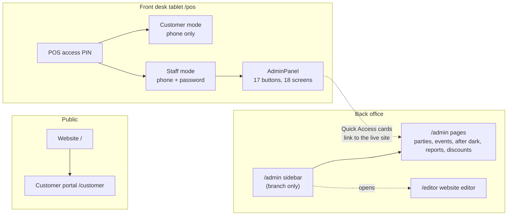

# Busy Bees Access Map

**Date:** 2026-09-30
**Covers:** the live site (`main`) and the `admin-shell` branch
**Purpose:** every door into the system in one place, so we can decide what to keep, merge and remove before redesigning the staff experience.

> Private: this document describes working weaknesses in the live site. Keep it in the repo; do not publish it.

## 1. The short version

Busy Bees has **nine separate doors** and **nine different credentials**. Staff use at least four of them in a normal week, and several open the same rooms.

The live site has three serious holes:

1. **No server-side guard has ever run.** `middleware.ts` sits at the repo root, and Next.js ignores it when the app lives in `src/`. Every `/admin` page check and every admin data route is open.
2. **The staff PIN is an admin key.** It signs everyone into one shared account whose role is `admin`, and `0297` is hardcoded to always work.
3. **Database passwords are guessable.** Customers get `PHONE-<phone>` and staff get `STAFF-<phone>-AUTH` behind the scenes. Anyone with a phone number and the site's public key can sign in to the database as that person.

The `admin-shell` branch fixes the first two and adds one staff sign-in, but it also adds a **tenth** door (`/admin/login`) and leaves several leftovers (section 6).

## 2. The doors today

## 3. Every door

| Door | Who | How you get in | Live site | Branch |
|---|---|---|---|---|
| Website `/` and public pages | Everyone | Open | Open | Open |
| Customer portal `/customer/*` | Parents | Phone + web password | Client-side check only | Same (server check left off on purpose) |
| POS unlock | Front desk device | **POS access PIN**, remembered for the browser tab | Yes | Changing it now needs admin |
| POS customer mode | Parents at the kiosk | **Phone number only** | Yes | Same |
| POS staff mode | Staff | **Phone + personal password**, from two different login forms | Yes | Also needs a live staff session to restore after reload |
| POS AdminPanel | Staff, owner | Inside staff mode | 17-button row | Same, plus reachable from `/admin` |
| `/admin` pages | Staff, owner | Each page had its own **staff PIN** screen; Reports had the **admin PIN** | Pages open, PIN screens only hide content | Behind one sign-in, PIN screens removed |
| `/admin/login` + sidebar | Staff, owner | **Staff code or admin code** | Does not exist | New |
| `/editor` | Owner | **Editor password**, stored in the browser | Falls back to a public default password | Needs editor password **and** admin sign-in |

Dead doors still referenced in code: `/auth/staff`, `/staff/*`, the mobile app (no login screen), `/?editor=true` (component never mounted).

## 4. Every credential

| # | Credential | Who types it | Stored | Opens | Live site | Branch |
|---|---|---|---|---|---|---|
| 1 | POS access PIN (4 to 6 digits) | Staff, once per tablet tab | `settings.pos_access_pin`, **plain text** | The kiosk screen | Yes, no attempt limit | Same; change needs admin |
| 2 | Staff PIN | Staff | `settings.staff_pin` plain text, **plus `0297` hardcoded** | `/admin` parties, events, after dark, as **admin** | Yes | **Removed** |
| 3 | Admin PIN | Owner | `settings.admin_pin` plain text | Reports (hides the page only) | Yes | **Removed** |
| 4 | Staff code | Staff | bcrypt hash | `/admin` except Owner area | No | **New** |
| 5 | Admin code | Owner | bcrypt hash | All of `/admin` | No | **New** |
| 6 | Personal staff phone + password | Each staff member | bcrypt hash per person | POS staff mode | Yes | Also opens `/admin` |
| 7 | Customer web password | Parents | bcrypt hash per person | Customer portal | Yes | Same |
| 8 | Customer phone (kiosk) | Parents | none | Kiosk customer mode; **also signs staff in if you type a staff phone** | Yes | Same |
| 9 | Editor password | Owner | env var, 24h browser token | Website editor | Public default fallback | No fallback; admin sign-in also required |
| 10 | `x-staff-pin: 0297` header | Nobody (code sends it) | **Hardcoded** | Skips the admin check on Stripe sync | Yes | **Still there** |

Machine-only secrets (not typed by people): cron secret, Stripe keys, database service key, and on the branch the two shared-account passwords and the session secret.

## 5. Accounts

| Account | Used by | Live role | Branch role |
|---|---|---|---|
| `staff@busybees.internal` | Anyone with the staff PIN | **admin** | staff |
| `admin@busybees.internal` | Anyone with the admin code | does not exist | admin |
| Personal staff accounts (for example Krista, Tim) | That person | staff or admin | same |
| Customers | Parents | customer | same |

## 6. What is broken, most urgent first

| # | Problem | Where | Fixed on branch? |
|---|---|---|---|
| 1 | No server-side guard runs; admin data routes are open to anyone | `middleware.ts` at repo root | Yes |
| 2 | Staff PIN signs in as admin; `0297` always works | `api/auth/staff-login` | Yes |
| 3 | Guessable database passwords for every customer and staff member | `pos-login`, `web-login`, `staff-auth` | **No** |
| 4 | Typing a staff member's phone at the kiosk signs you in as them | `api/auth/pos-login` (no role filter) | Partly (POS restore now needs a staff session) |
| 5 | `0297` hardcoded in the Stripe sync route and sent by the POS | `api/stripe/sync:94`, `AdminPanel.tsx:858` | **No** |
| 6 | Editor page shows the old default password as a hint | `app/editor/page.tsx:125`, `EditorDashboard.tsx:123` | **No** |
| 7 | Kiosk group-rate stopgap lets any signed-in customer search children (with parent phones) and mark waivers | `lib/admin/api-access.ts` | Stopgap, open decision |
| 8 | POS access PIN stored in plain text, no attempt limit | `api/pos/verify-pin` | **No** |
| 9 | Two staff login forms in the POS; the logo toggles login and logout | `pos/page.tsx`, `PhoneLogin.tsx` | **No** |
| 10 | Staff in the POS cannot reach the Check In screen | `pos/page.tsx` | **No** |
| 11 | AdminPanel Quick Access cards jump to the live website in a new tab | `AdminPanel.tsx:5738-5823` | **No** |
| 12 | Staff see Settings and Products; Sales hides only its button | `AdminPanel.tsx` | Partly (sidebar hides them) |
| 13 | Dead doors and unused fields (`/auth/staff`, `users.pin_hash`, editor component, mobile app login) | various | **No** |

## 7. Where this points

Staff should need **two things at most**: the tablet unlock, and **one personal sign-in** that opens everything their role allows, on one screen with one menu. Today they juggle up to five.

Decisions to make before designing the new staff experience:

1. **Personal logins or shared codes?** Personal phone + password logins already exist and are what the POS uses. The branch's shared staff and admin codes duplicate them. Keeping one of the two removes a whole door.
2. **One place or two?** Should the POS staff side and `/admin` become the same screen (sidebar inside the POS), or stay separate?
3. **Kiosk and staff on one device?** The tablet is both a parent kiosk and a staff terminal. How staff switch in and out matters for the design.
4. **Fix the guessable passwords now or later?** Item 3 is the largest remaining hole and touches every login.
