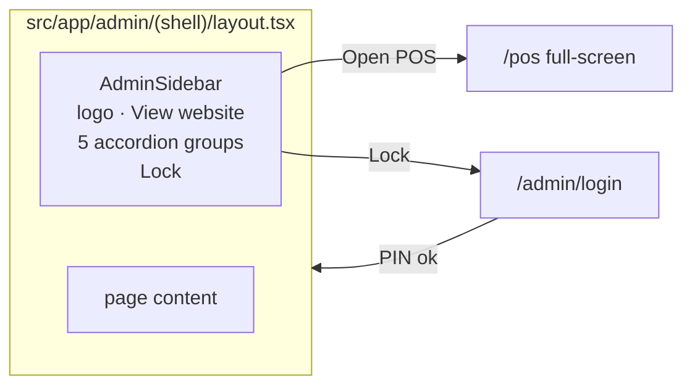
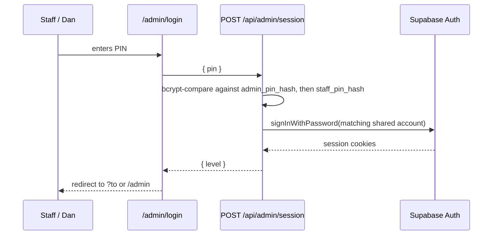

# Admin Shell: One Login, One Sidebar

**Date:** 2026-09-29
**Branch:** `claude/p26927-168-admin-shell` (cut from `main` at `08f6fda`)
**Status:** Draft for review
**Reference build:** Klynkz operator app (`Light-Brands/klynkz`, `lib/app/nav.ts`, `components/app/AppSidebar.tsx`, `lib/app/auth.ts`)

## 1. Why

The features behind the Busy Bees staff side are strong; getting to them is not.

- **Four separate locks.** The POS has its own access code. Parties, Events and After Dark each render their own staff PIN screen (unlock held in React state, lost on reload). Reports has its own admin PIN. The website editor has its own password.
- **No way in.** The homepage and public header link to none of it. Staff type URLs or use hard-coded "Quick Access" cards buried at the bottom of the POS admin panel.
- **Admin lives inside the POS.** `src/components/pos/AdminPanel.tsx` (5,826 lines) holds 18 views switched by a horizontal button row: customers, sales, passes, punch cards, gift cards, coupons, members, settings and more.
- **Open data.** Most `/api/admin/*` routes use the service-role client with no caller check (`reports/*`, `customers`, `events`, `after-dark-*`, `gift-cards`, `punch-cards`, `groups`, among others). Whoever knows the URL can read the data, regardless of any PIN screen.
- **Hardcoded fallbacks.** `DEFAULT_STAFF_PIN = '0297'` in `src/app/api/auth/staff-login/route.ts`; editor password and JWT secret defaults in `src/app/api/editor/auth/route.ts`.

## 2. Goal

One login opens a left sidebar that holds every staff and admin space, grouped by category. The admin PIN is the master key; the staff PIN opens everything except the Owner area. The session holds across every page until it expires or someone taps Lock.

**Success looks like:**
1. Dan enters the admin PIN once and can reach every dashboard from the sidebar without another prompt.
2. A staff member enters the staff PIN once and reaches every non-Owner space; an Owner item asks for the admin PIN in place.
3. A page reload keeps the session.
4. Every `/api/admin/*` route refuses a caller without the right session (verified by a test per route).
5. The POS kiosk still runs full-screen for customers.
6. No behavior of any existing feature changes other than how you reach it.

## 3. Decisions already made

| Decision | Choice |
|---|---|
| Login model | One shared **staff PIN** plus one **admin PIN**. No per-person staff logins in this work. |
| Admin PIN | Master key. Entered at the login screen, it opens every space. |
| Owner area | Sales, Reports, Products, Settings, Website Editor require admin level. Staff hitting one get an admin-PIN prompt that upgrades the session. |
| POS | Stays a full-screen kiosk outside the shell, with its own kiosk code for the front-desk device. A signed-in staff/admin session opens it without asking. |
| Build approach | Shell first, then lift views out of `AdminPanel.tsx` one at a time. Existing view code is moved, not rewritten. |
| Public site | Untouched. Customer accounts untouched. |

**Accepted trade-off:** a shared PIN means actions are not tied to a named person, and anyone told a code has that code's full access. This was chosen for front-desk speed. Per-person logins remain possible later because the existing phone + password staff auth (`/api/auth/staff-auth`) is left in place.

## 4. Navigation

### 4.1 Menu map

| Group | Item | Route | Level | Source today |
|---|---|---|---|---|
| Front Desk | Today | `/admin` | staff | AdminPanel `dashboard` |
| Front Desk | Open POS ↗ | `/pos` (new tab, full-screen) | staff | `/pos` |
| Front Desk | Sessions | `/admin/sessions` | staff | AdminPanel `sessions` |
| Bookings | Parties | `/admin/parties` | staff | `/admin/parties` (+ AdminPanel `parties`) |
| Bookings | Events | `/admin/events` | staff | `/admin/events` (+ AdminPanel `events`) |
| Bookings | After Dark | `/admin/after-dark` | staff | `/admin/after-dark` (+ AdminPanel `after-dark`) |
| Bookings | Groups | `/admin/groups` | staff | AdminPanel `groups` |
| Customers | Customers | `/admin/customers` | staff | AdminPanel `customers` |
| Customers | Monthly Members | `/admin/members` | staff | AdminPanel `monthly-members` |
| Customers | Passes | `/admin/passes` | staff | AdminPanel `passes` |
| Customers | Punch Cards | `/admin/punch-cards` | staff | AdminPanel `punch-cards` |
| Customers | Gift Cards | `/admin/gift-cards` | staff | AdminPanel `gift-cards` |
| Marketing | Specials | `/admin/specials` | staff | AdminPanel `marketing` |
| Marketing | Coupons | `/admin/coupons` | staff | AdminPanel `coupons` |
| Marketing | Sibling Discounts | `/admin/discounts` | staff | `/admin/discounts` |
| Marketing | Newsletter | `/admin/newsletter` | staff | AdminPanel `newsletter` |
| Marketing | Announcements | `/admin/announcements` | staff | AdminPanel `announcements` |
| Owner | Sales | `/admin/sales` | admin | AdminPanel `sales` |
| Owner | Reports | `/admin/reports` | admin | `/admin/reports` |
| Owner | Products | `/admin/products` | admin | AdminPanel `products` |
| Owner | Website Editor ↗ | `/editor` | admin | `/editor` |
| Owner | Settings | `/admin/settings` | admin | AdminPanel `settings` (codes, staff) |

Where a view exists both as an `/admin/*` page and inside AdminPanel (Parties, Events, After Dark), the sidebar points at the `/admin/*` page. During migration each pair is compared; anything the AdminPanel copy does that the page lacks is carried over before the AdminPanel copy is deleted.

### 4.2 One source of truth

`src/lib/admin/nav.ts` (ported from Klynkz `lib/app/nav.ts`):

```ts
type Level = 'staff' | 'admin';
type NavItem  = { id: string; label: string; href: string; icon: LucideIcon; level: Level; external?: boolean };
type NavGroup = { id: string; label: string; icon: LucideIcon; items: NavItem[] };

export const NAV: NavGroup[];
export function navFor(level: Level): NavGroup[];          // staff sees Owner items with a lock badge
export function levelForPath(pathname: string): Level;     // longest-prefix match over NAV hrefs
```

The sidebar, the page guards, the middleware and the API guard all read this file. A page cannot appear in the menu with one access rule and be guarded by another.

### 4.3 Shell



- **Route group:** `src/app/admin/(shell)/layout.tsx` wraps every sidebar page. `/admin/login` sits outside the group, so it has no sidebar.
- **`AdminSidebar`** (`src/components/admin/shell/AdminSidebar.tsx`, client) ported from Klynkz `AppSidebar`:
  - Accordion, one group open at a time, auto-opens the group holding the active page.
  - Active item = longest matching href.
  - Owner items show a lock icon while the session is staff-level.
  - Top: Busy Bees mark, "View website" link to `/`.
  - Bottom: current level ("Staff" or "Admin") and **Lock**.
- **Mobile:** below `lg`, the sidebar becomes a slide-out drawer with a hamburger in a slim top bar. Klynkz has no mobile treatment; this is new.
- **Page header:** a small shared `AdminPageHeader` (title, description, actions slot) replaces the per-page headers each `/admin/*` page renders today.
- **Styling:** existing Tailwind v4 brand tokens (`honey`, `charcoal`, `pastel`). The shell uses the Arial override the POS already uses (`.pos-page-static` pattern) for legibility; the Gloria Hallelujah display font stays on the public site.

## 5. Login and session

### 5.1 How the two PINs map to accounts

The app already signs the shared staff PIN into one Supabase account, `staff@busybees.internal`, currently with role **admin**. This work splits that into two shared accounts so the database itself knows the level:

| PIN | Supabase account | `public.users.role` |
|---|---|---|
| Staff PIN | `staff@busybees.internal` | `staff` |
| Admin PIN | `admin@busybees.internal` | `admin` |

Because the level lives in the real Supabase session and the existing `role` column, the existing middleware checks, the RLS helpers `is_staff_or_admin()` / `is_admin()`, and `src/lib/auth/auth-server-helpers.ts` all enforce it without a second, parallel session system.

### 5.2 Flow



- **One endpoint:** `POST /api/admin/session` takes `{ pin }`, tries the admin hash first, then the staff hash, signs in the matching shared account server-side, sets the Supabase cookies, and records `bb_session_started` (HttpOnly) for the 12-hour limit.
- **Shared-account passwords** live only in server env (`STAFF_ACCOUNT_PASSWORD`, `ADMIN_ACCOUNT_PASSWORD`). They are never shown to anyone and never typed by staff.
- **Upgrade:** when a staff session opens an admin page, the page renders an in-place PIN prompt (same component as login). A correct admin PIN calls the same endpoint and swaps the session to the admin account.
- **Lock:** `DELETE /api/admin/session` signs out and clears `bb_session_started`.
- **Expiry:** middleware signs out any staff/admin session whose `bb_session_started` is older than 12 hours.
- **Rate limit:** 5 wrong PINs from one IP within 10 minutes locks that IP for 10 minutes (in-memory per instance is acceptable for a first version; noted as a limit).
- **Safe redirect:** `?to` is honored only for paths starting with `/admin`.

### 5.3 PIN storage

- New settings keys `staff_pin_hash` and `admin_pin_hash`, bcrypt, using the existing unused helper `src/lib/auth/pin.ts`.
- A one-time migration hashes the current `settings.staff_pin` and `settings.admin_pin` into the new keys, then clears the plaintext values.
- `DEFAULT_STAFF_PIN = '0297'` is deleted. With no hash set, login refuses and shows "No PIN configured" rather than falling back.
- Settings (admin only) gets "Change staff PIN" and "Change admin PIN", writing hashes.

### 5.4 What retires

| Retired | Replaced by |
|---|---|
| PIN screens inside `/admin/parties`, `/admin/events`, `/admin/after-dark` | Shell guard |
| `/api/admin/check-admin-pin` + Reports PIN screen | `level: admin` on Reports |
| `/api/auth/staff-login` (already marked deprecated) | `/api/admin/session` |
| Editor password + JWT (`/api/editor/auth`, `EDITOR_PASSWORD` default, `JWT_SECRET` default) | Admin session check on `/editor` in middleware and on editor save routes |
| AdminPanel "Quick Access" absolute links | Sidebar |
| Staff/admin entry via POS `PhoneLogin` `onAdminAccess` | "Admin" button on the POS that opens `/admin` |

The POS kiosk code (`settings.pos_access_pin`, `PosPinGate`) stays. The per-person phone + password route (`/api/auth/staff-auth`) stays but is no longer linked from the admin side.

## 6. Guards

Three layers, all reading `nav.ts`:

1. **Middleware** (`middleware.ts`): for `/admin/*` except `/admin/login`, require a signed-in user with role `staff` or `admin`, else redirect to `/admin/login?to=…`. Enforce the 12-hour limit. Fix the current redirect target (`/auth/staff`, which 404s on main). Add `/editor` with admin level.
2. **Page guard** (`src/lib/admin/guard.ts`): `requireLevel(level)` in each server page or the shell layout. Staff on an admin page gets the upgrade prompt, not a redirect.
3. **API guard** (`src/lib/admin/api-guard.ts`): `withAdminAuth(level, handler)` wraps every route handler under `src/app/api/admin/*`. Returns 401 with no session and 403 for the wrong level. The service-role client is created only after the check passes. Each route's level is written next to the handler, matching the page that calls it (reports, fixed-expenses, top-customers, staff and settings writes are `admin`; the rest `staff`). Existing inline role checks in `party-bookings`, `staff-discounts`, `sibling-discounts`, `party-time-slots` and `staff` are replaced by the wrapper.

Other admin-writing routes outside `/api/admin` (`/api/settings/*`) get the same wrapper at `admin` level. POS routes under `/api/pos/*` keep their current behavior in this work; auditing them is listed as follow-up (section 10).

## 7. Migrating the AdminPanel views

Each of the 18 views becomes a page at the route in 4.1:

1. Extract the view's JSX and its state/handlers from `AdminPanel.tsx` into `src/components/admin/views/<Name>View.tsx`, unchanged in behavior.
2. Add `src/app/admin/(shell)/<route>/page.tsx` that renders the view.
3. Point the sidebar at it.
4. Remove the view from AdminPanel.

Order: least entangled first (Announcements, Newsletter, Coupons), shared-state views last (Dashboard, Sales, Customers). State shared between views (for example a customer list reused by several) moves into a small hook in `src/components/admin/views/hooks/`. When the last view leaves, `AdminPanel.tsx` is deleted and the POS "Admin" button opens `/admin`.

## 8. Error handling

- Wrong PIN: shake the pad, "That code didn't match", attempts remaining after the 3rd miss.
- Locked out: "Too many tries. Try again in N minutes."
- No PIN configured: "No staff PIN is set yet. Ask the owner to set one in Settings." (admin PIN missing: login cannot proceed; see section 11 for setup).
- Session expired mid-task: next navigation redirects to login with `?to`; unsaved form data on the current page is not preserved (same as today).
- API 401/403 surfaced in views as "Your session ended, sign in again" with a link to login, instead of a silent empty list.

## 9. Testing

- **Unit:** `navFor`, `levelForPath` (longest match, unknown path defaults to `admin`), PIN verify (admin hash wins when both match), rate limiter, safe `?to`.
- **API guard, per route:** for every file under `src/app/api/admin/**/route.ts`, a generated test asserts 401 with no session and 403 for staff on admin routes. A test that lists route files and fails when a route is not wrapped keeps new routes from shipping open. Each guard test is proven by removing the wrapper and watching it fail before commit.
- **E2E (Playwright):** staff PIN → sidebar without Owner access → Owner item prompts → admin PIN upgrades; admin PIN → every sidebar link loads; reload keeps session; Lock returns to login; mobile drawer opens and closes.
- **Regression per migrated view:** before and after screenshots and one smoke action per view (open, search or filter, open a record).
- `next build` passes before merge.

## 10. Out of scope

- Rebuilding screens on Klynkz `TableScreen` / `DataTable` (a later pass once the shell exists).
- Per-person staff logins and an audit trail of who did what.
- Changes to the public site, customer accounts, or POS checkout behavior.
- Auditing `/api/pos/*` routes (follow-up issue).

## 11. Setup and rollout

1. Create `admin@busybees.internal` in Supabase Auth; set `staff@busybees.internal` to role `staff`. Put both passwords in Vercel env.
2. Run the PIN-hash migration. Confirm with Dan the admin and staff PINs he wants before clearing plaintext.
3. Ship the shell, login, guards and API wrapper first (views reached through the old AdminPanel inside the shell's Today page until migrated).
4. Migrate views in the section 7 order, one PR each or small batches.
5. Delete AdminPanel and the retired routes.

**Risk:** the moment the API wrapper ships, any client code calling `/api/admin/*` without a session breaks. The POS AdminPanel runs under the shared staff session today, so it keeps working, but the kiosk (customer mode) must not call admin routes; step 3 includes checking the POS network calls in customer mode.
